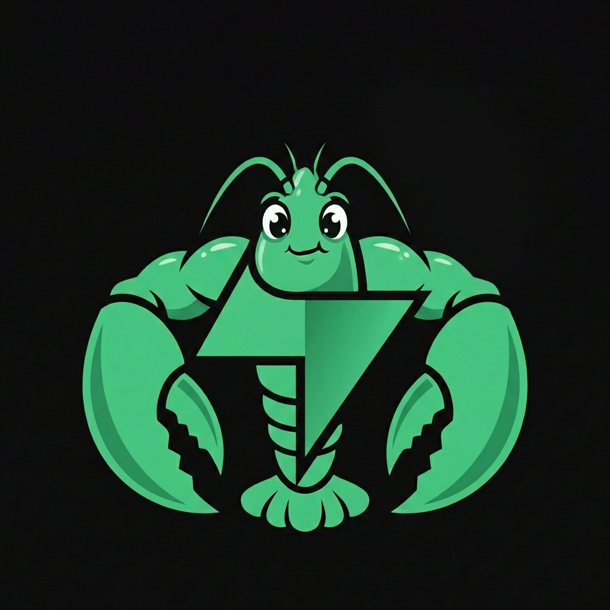

<p align='center'>

</p>

# SupaClaw 

Built entirely on Supabase built-in features. Use within your Supabase account or fully self-host.

***Why?***

Because why not.

I use Supabase daily. I know it. I trust it. I'm already self-hosting it for production projects. It already ships with every primitive needed. 

- Store and host everything in Supabase, no other Cloud provider or infrastructure needed
- Minimal Dependencies: Supabase, Vercel AI SDK, your LLM provider, and croner for cron scheduling — thats it
- Production ready, battle tested & secure tech, not re-inventing the wheel
- Cloud or self hosting: Fast cloud setup, port to private self hosting later

## Where SupaClaw is different

SupaClaw is not trying to out-feature OpenClaw. It optimizes for a different goal: 

> Supabase-native operations with minimal moving parts + Supabase goodies out of the box (e.g. Admin Dashboard, API's, SDK's).

- **One control plane:** Database, storage, auth, logs, cron, and edge runtime are all native Supabase primitives that can be managed via the built-in Admin Dashboard.
- **Durable by design:** Inbound events are persisted and queued first, then processed by workers with retry + idempotency semantics.
- **SQL-driven scheduling:** Scheduled work is managed by Postgres (`pg_cron`) instead of a custom always-on scheduler process.
- **Serverless worker loop:** Webhook ingest and agent execution run as edge functions, with cron as a durable backstop.
- **Data properly stored:** Messages, jobs, and tasks are directly inspectable and debuggable in SQL and Supabase dashboard views.
- **Lower infra overhead:** No dedicated daemon host, no separate queue broker, no extra orchestration layer required.

# Quickstart

Get SupaClaw running in under 5 minutes.

## Prerequisites

1. **Supabase CLI installed**: Install via `brew install supabase/tap/supabase`
2. **Deno CLI installed**: Install via `brew install deno`
3. **Docker Desktop App**: Must be running on your machine
4. **AI API Key**: Get one from [Anthropic](https://console.anthropic.com) or [OpenAI](https://platform.openai.com)

## Interactive setup walkthrough

Use this script to get guided through all steps. It discovers already set config and running services and idempotently installs/migrates/starts everything step by step.

```bash
bash ./scripts/install.sh
```

In a nutshell this script basically runs:

```bash
supabase start
supabase db push --local
ngrok http 54321
supabase storage cp (agent files)
select vault.create_secret(...)
curl -sS -X POST "https://api.telegram.org/bot${TELEGRAM_BOT_TOKEN}/setWebhook"
supabase functions serve
```

For a detailed walkthrough documentation (for local or cloud deployment) look at [DEPLOY.md](DEPLOY.md)

**That's it.** No daemon setup, no complex config, no VPS, no security headaches.

## Architecture

For fancy diagrams look into [ARCHITECTURE.md](ARCHITECTURE.md)

Check out [PRD.md](PRD.md) to see how I briefed my coding agents.

For security-minded folks, see [SECURITY.md](SECURITY.md).

## Roadmap

### Done (v0.1.0)
- ✅ Core architecture
- ✅ Supabase integration (schema + jobs)
- ✅ Telegram webhook + worker
- ✅ Memory tables + hybrid search (FTS + pgvector)
- ✅ Tools (read/write/list/edit)
- ✅ Skills
- ✅ Cron tool (reminders, scheduled tasks, recurring jobs)

### Missing (v0.2.0)
- [ ] More channels (Slack, Whatsapp, ..)
- [ ] More tools (web/search)
- [ ] Sandbox shell execution
- [ ] Self access via Github
- [ ] Connectors (calendar, email, etc.)
- [ ] Web chat UI

## Support

- **Issues**: [GitHub Issues](https://github.com/vincenzodomina/supaclaw/issues)

## Contributions

...are welcome! 

Fork it, tweak it, PR it, repeat!

## Credits

Inspired by [OpenClaw](https://github.com/openclaw/openclaw) - amazing project

Built with: 
- [Supabase](https://supabase.com) - the goat
- [Vercel AI SDK](https://ai-sdk.dev/) - awesome multi provider support
- [OpenCode](https://github.com/sst/opencode) - inspiration for the tools

> This project is not affiliated with Supabase

## License

MIT License - see [LICENSE](LICENSE) file for details.

---

**SupaClaw**: Keep it yours. 🦀